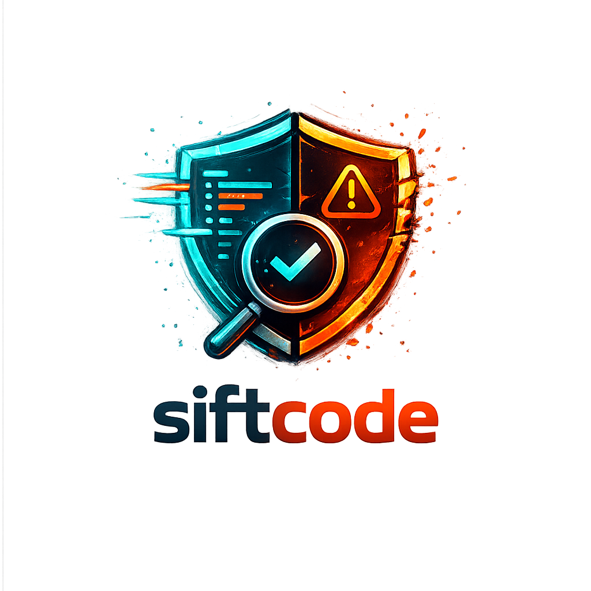

<p align="center">
  
</p>

<h1 align="center">siftcode</h1>

<p align="center"><strong>Sift through AI code changes. Review every line.</strong></p>

<p align="center">
  <a href="https://github.com/charlie-robison/siftcode/releases">Desktop App (macOS)</a> ·
  VS Code / Cursor Extension ·
  JetBrains Plugin (IntelliJ, PyCharm, WebStorm)
</p>

---

siftcode is a code audit tool that lets you review AI-generated code changes **line by line** before they reach production. It works with any coding agent and any editor — it reads your git diff and gives you a clean UI to accept or reject each individual line.

This is not an IDE. It's a quality gate. Your coding agent does the work, siftcode lets you verify it.

## Why

AI coding agents can write hundreds of lines in seconds. Most of it is fine. Some of it is slop — unnecessary abstractions, wrong assumptions, subtle bugs, security issues. The problem is that reviewing a massive diff in your terminal or git client is tedious, and it's easy to rubber-stamp changes that shouldn't ship.

siftcode gives you a purpose-built interface for exactly one thing: deciding which AI-generated lines make it into your codebase and which don't.

## How It Works

```
1. Run your coding agent normally (Claude Code, Codex, Cursor, etc.)
   → Agent edits files in your repo

2. Open siftcode (desktop app, VS Code, or JetBrains)
   → Reads git diff, shows every change with syntax highlighting

3. Review line by line
   → Click gutter icons to accept/reject individual lines
   → Accept & dismiss entire files when they look good
   → Reject the slop

4. Apply
   → Only accepted changes are written to disk
   → Rejected lines are reverted to the original
   → Your IDE picks up the clean result
```

---

## Install

siftcode is available in three forms. Use whichever fits your workflow.

### Option 1: Desktop App (macOS)

Download the DMG from the [latest release](https://github.com/charlie-robison/siftcode/releases):

1. Download `siftcode-0.1.0-arm64.dmg`
2. Open the DMG, drag **siftcode** into **Applications**
3. Open siftcode from Applications
4. Click **Add Folder** to open a git repo with changes
5. Review and apply

You can open multiple repos at once — each appears as a group in the sidebar.

### Option 2: VS Code / Cursor Extension

Install the `.vsix` file:

1. Download or build the extension:
   ```bash
   git clone https://github.com/charlie-robison/siftcode.git
   cd siftcode/vscode-extension
   npx @vscode/vsce package --allow-missing-repository
   ```
2. Install in VS Code:
   ```bash
   code --install-extension siftcode-0.1.0.vsix
   ```
   Or in Cursor:
   ```bash
   cursor --install-extension siftcode-0.1.0.vsix
   ```
3. Open your project folder in VS Code / Cursor
4. Open Command Palette (`Cmd+Shift+P`) → **siftcode: Review Changes**
5. Review changes in the webview panel — click ✓/✗ icons to toggle lines
6. Click **Apply Changes** when done

### Option 3: JetBrains Plugin (IntelliJ, PyCharm, WebStorm)

Install the plugin zip:

1. Download or build the plugin:
   ```bash
   git clone https://github.com/charlie-robison/siftcode.git
   cd siftcode/jetbrains-plugin
   gradle buildPlugin
   ```
2. In your JetBrains IDE: **Settings → Plugins → gear icon → Install Plugin from Disk**
3. Select `jetbrains-plugin/build/distributions/siftcode-0.1.0.zip`
4. Restart the IDE
5. Open the **siftcode** tool window at the bottom of the IDE
6. Or go to **Tools → Review Changes**
7. Review changes and click **Apply Changes** when done

### Build from Source (Desktop App)

Requires [Node.js](https://nodejs.org/) 18+.

```bash
git clone https://github.com/charlie-robison/siftcode.git
cd siftcode
npm install
```

**Run in development:**
```bash
npm run dev
```

**Build a DMG:**
```bash
npm run dist
```
The DMG will be in `release/`.

---

## Controls

All three versions share the same controls:

| Action | How |
|--------|-----|
| **Accept/reject a line** | Click the ✓ or ✗ icon in the gutter |
| **Accept & dismiss file** | Click "Accept & Done" in the toolbar |
| **Reject & dismiss file** | Click "Reject & Done" in the toolbar |
| **Dismiss a file** | Hover over a file in the sidebar, click ✕ (desktop app) |
| **Accept all changes** | Click "Accept All" in the toolbar |
| **Reject all changes** | Click "Reject All" in the toolbar |
| **Bring back dismissed files** | Click "+N dismissed" in the sidebar (desktop app) |
| **Apply changes to disk** | Click "Apply Changes" — writes accepted lines, reverts rejected ones |
| **Refresh** | Click "Refresh" to re-read the git diff |
| **Add another folder** | Click "Add Folder" (desktop app) or re-run the command (extensions) |

## What It Audits

siftcode reviews:

- **Modified tracked files** — changes shown via `git diff`
- **New untracked files** — every line shown as an addition you can accept or reject

This covers the typical workflow:

1. You have a clean working tree
2. An AI agent edits your files or creates new ones
3. You open siftcode to review before staging/committing

## What It Doesn't Do

- It is not an IDE or editor — you don't write code here
- It does not run or wrap your coding agent — use your agent normally, then audit with siftcode
- It does not auto-commit or push — you decide what happens after applying

## Agent Agnostic

siftcode works with any tool that edits files in a git repo:

- **Claude Code** (CLI)
- **Codex** (OpenAI)
- **Cursor**
- **GitHub Copilot**
- **Windsurf**
- **aider**
- **Cline**
- **Any MCP-based agent**
- **Any script or tool that modifies code**

If it shows up in `git diff`, siftcode can audit it.

## Project Structure

```
siftcode/
├── electron/              # Desktop app — Electron main process
├── src/                   # Desktop app — React + Monaco UI
├── vscode-extension/      # VS Code / Cursor extension
├── jetbrains-plugin/      # IntelliJ / PyCharm / WebStorm plugin
├── icon.png               # App icon (1024x1024)
├── package.json           # Desktop app config + electron-builder
└── README.md
```

## Tech Stack

| Component | Tech |
|-----------|------|
| **Desktop app** | Electron, React, Monaco Editor, Vite |
| **VS Code extension** | VS Code Webview API |
| **JetBrains plugin** | Kotlin, JCEF (embedded browser) |
| **Diff engine** | Custom unified diff parser + reconstructor |
| **Backend** | None — everything runs locally, nothing leaves your machine |

## License

MIT
